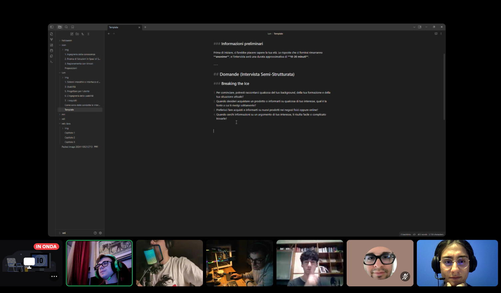
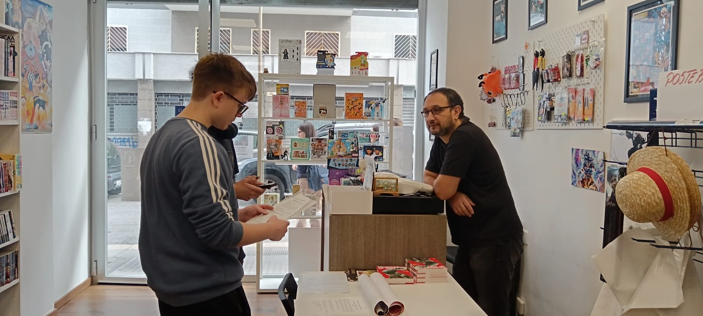
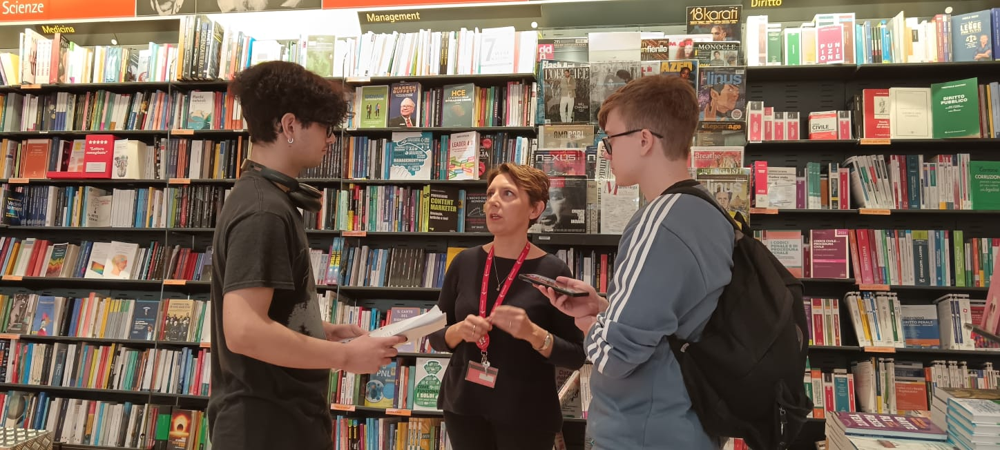
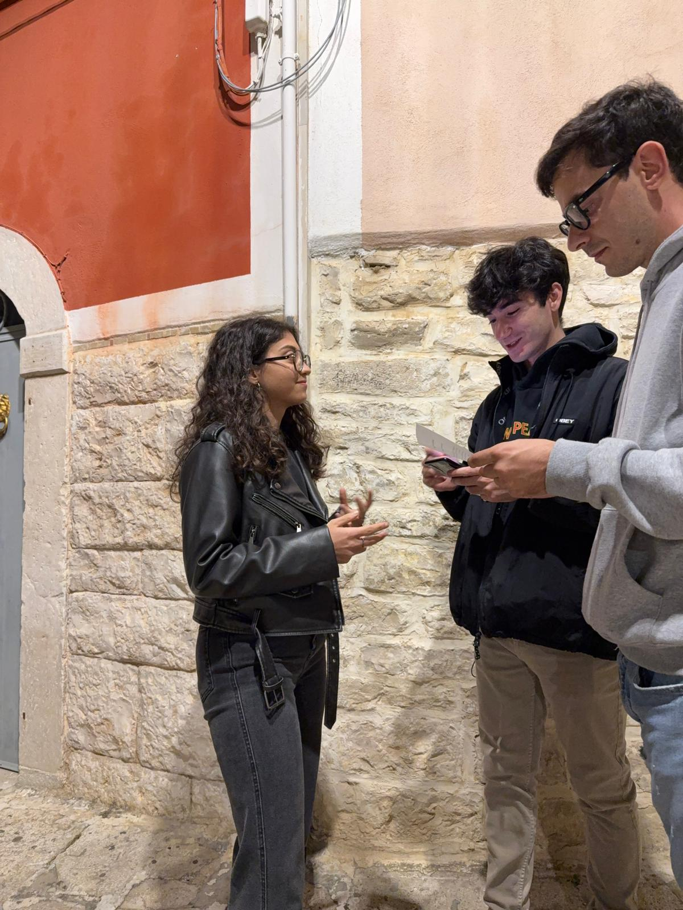
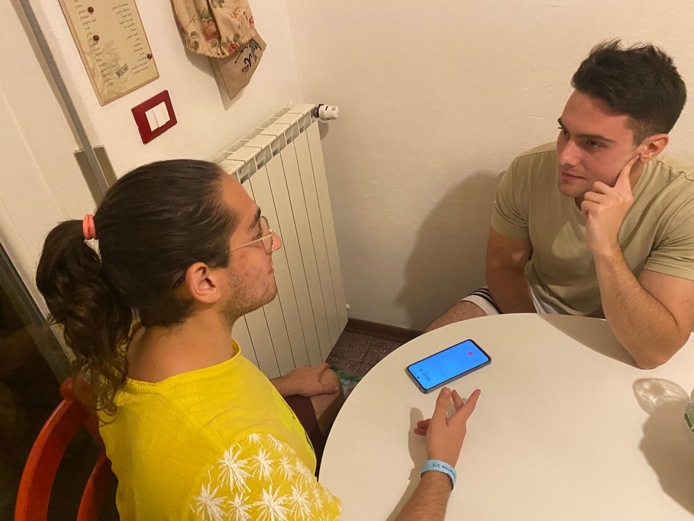
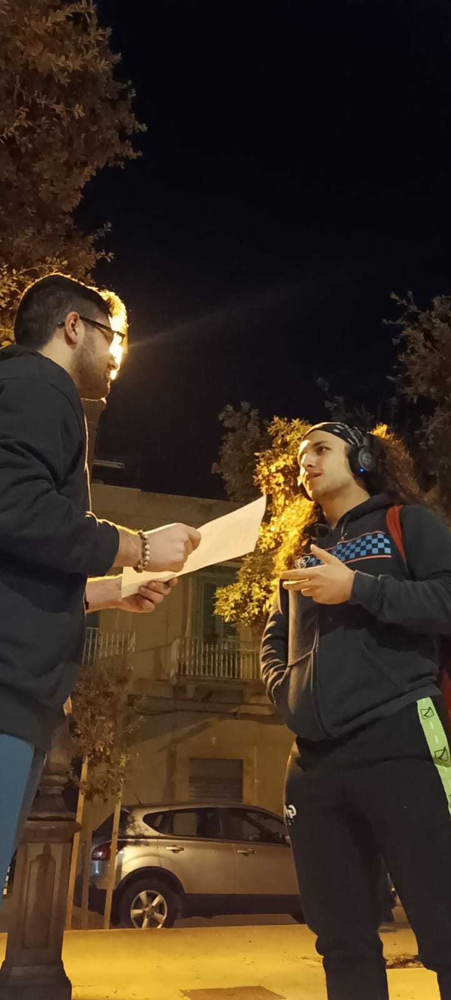

## Preparazione dell’intervista

Abbiamo preparato l’insieme delle domande basandoci sul template incluso nel materiale didattico. Ci siamo riuniti mediante chiamata vocale su Discord e abbiamo utilizzato il software [Obsidian](https://obsidian.md/) per collaborare comodamente. Dopo aver riflettuto su quali informazioni ci servisse estrapolare dagli intervistati, sulla natura della nostra idea e su ciò che avevamo concluso dalla fase precedente di lavoro, abbiamo dedotto che sarebbe stato fondamentale sapere: 

- se l’idea fosse appetibile al mercato 
- se gli intervistati l’avrebbero utilizzata 
- come l’avrebbero utilizzata 
- quali esempi di buon design avremmo potuto seguire 

Sulla base di ciò abbiamo elaborato un primo insieme delle domande che abbiamo messo alla prova nell’intervista pilota.

## Risultati intervista pilota

Svolgendo l’intervista di prova internamente al gruppo, abbiamo concluso che le domande, la loro composizione e l’ordine in cui sono poste ci permettono di ottenere efficacemente le informazioni relative all’appetibilità dell’idea e alle aspettative e utilizzo che gli utenti ne farebbero. Abbiamo inoltre raffinato l’insieme delle domande rimuovendo la seguente: 

>”Potresti darmi degli esempi di app che trovi esteticamente sgradevoli o difficili da utilizzare e le ragioni per cui lo pensi?”; 

Poiché intervistati più grandi d’età non avrebbero saputo rispondere in maniera esauriente e avrebbe appesantito troppo l’intervista, inoltre il nostro interesse è maggiormente negli aspetti da perseguire piuttosto che in quelli da evitare. Infine, svolgendo questo prototipo di intervista insieme, abbiamo potuto porci tutti sullo stesso piano relativamente al senso delle domande, al come porle e alle risposte che vogliamo ottenere, così da poter realizzare delle interviste standardizzate.

**L'insieme delle domande è contenuto nel file dal nome [Template](./template_interviste/Template_interviste.md).** 

## Come sono state condotte le interviste

### Porcelli Andrea

L' intervista è stata effettuata a un proprietario di negozio, che svolge anche la funzione di libraio sulla cinquantina d'anni, ha bisogno di un sistema intuitivo, facile e alla portata del gap generazionale dei suoi clienti, creando un collegamento tra libreria e cliente. 
L' obbiettivo auspicabile è la realizzazione di una finestra sul cliente, che rende il consigliare libri e fumetti un caso d'uso efficiente, efficace e soddisfacente .

### Fabio Zippo 

Dovendo intervistare un dipendente di una libreria, io e i miei colleghi ci siamo recati in Feltrinelli e abbiamo chiesto il permesso di condurre un'intervista al direttore, ottenuto questo abbiamo cercato dipendenti liberi, vedendo molti dipendenti al lavoro, abbiamo scelto di intervistare una libraia che era al bancone libera, le ho parlato introducendo noi e il motivo dell'intervista e lei ha subito messo la sua disponibilità chiamando una collega a sostituirla al bancone. 
Il punto principale di ciò che ci ha detto l'intervistata è l'interazione tra il lettore e gli esperti, focalizzandosi sul consigliare letture e poter vedere le letture preferite degli altri utenti e scrittori. 
Inoltre ha suggerito di focalizzarsi sul coinvolgere i giovani tramite quest'iniziativa e avvicinarli al mondo della lettura vedendo il movimento verso la lettura che per esempio gli influencer possono creare

### Sgaramella Francesco

L' intervista è stata effettuata a un lettore Sporadico nello specifico, una studentessa universitaria di 20 anni, ha bisogno di un sistema veloce ed intuitivo al fine di non perdere tempo.
Pur non essendo una lettrice esperta, vorrebbe scrivere piccole recensioni al fine di comunicare con i suoi amici o con la community.

### Elia Sakellarides

L'intervista è stata effettuata con un lettore sporadico, studente di giurisprudenza al quinto anno, di 24 anni, Per informarsi o acquistare prodotti, si affida principalmente a internet e ai social media, come Instagram, preferendo un'analisi iniziale online e successivamente valutando di persona, se possibile. Nel contesto della lettura, dichiara di leggere circa quattro libri all'anno, trovando piacere nel farlo e trovando principalmente le informazioni che cerca attraverso canali digitali. È favorevole all’uso di tecnologie informative e ritiene utile l'ausilio di strumenti digitali per migliorare l'efficacia della ricerca di informazioni, valorizzando facilità d’uso ed efficienza. È aperta a utilizzare strumenti digitali per ampliare le proprie conoscenze e si dice attento alle recensioni, vedendole come elementi importanti nella decisione d'acquisto.

### Michele Pontrelli

L'intervista è stata fatta ad un utente della classe dei lettori esperti, uno studente universitario di 20 anni che frequenta il corso di Ingegneria Informatica del Politecnico di Milano. L’intervista si è svolta a casa sua ed a ricoprire il ruolo di osservatore era Fabio Zippo il quale ha preso appunti relativamente alle risposte dell’intervistato; inoltre è stato registrato l’intero discorso così da poter successivamente corroborare appunti e risposte effettive così da poter compilare facilmente ed efficacemente il documento.

### Nicolo' Pacucci

Durante l’intervista, è stato chiesto a un amico di 21 anni, studente di fisica e lettore esperto, di condividere le sue opinioni su un progetto riguardante un’app per libri. L’obiettivo era capire quali funzionalità un utente esperto come lui ritenesse fondamentali per un’app dedicata agli appassionati di lettura. Tra gli argomenti trattati ci sono stati i suggerimenti personalizzati, le recensioni e altre modalità pensate per arricchire l’esperienza di lettura.

L’intervista si è svolta in modo informale e si è rivelata molto interessante: sono state poste domande aperte, con l’intento di permettere all’intervistato di esprimersi liberamente e raccontare le sue aspettative riguardo un’app progettata per un pubblico di lettori appassionati.

## UX Goals
I tre obiettivi che abbiamo scelto sono:
- STIMULATION
- DISCOVERY
- DREAMYNESS

Il motivo è che il nostro programma vuole essere molto facile con l'utente di qualsiasi gruppo e deve
invogliare alla lettura, scoperta di nuovi titoli e interagire con altre persone, facilitando la comunicazione
libreria-cliente.
